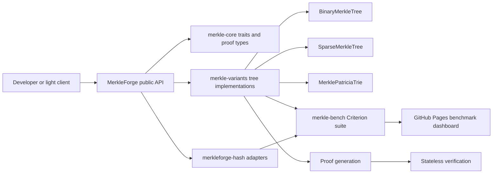
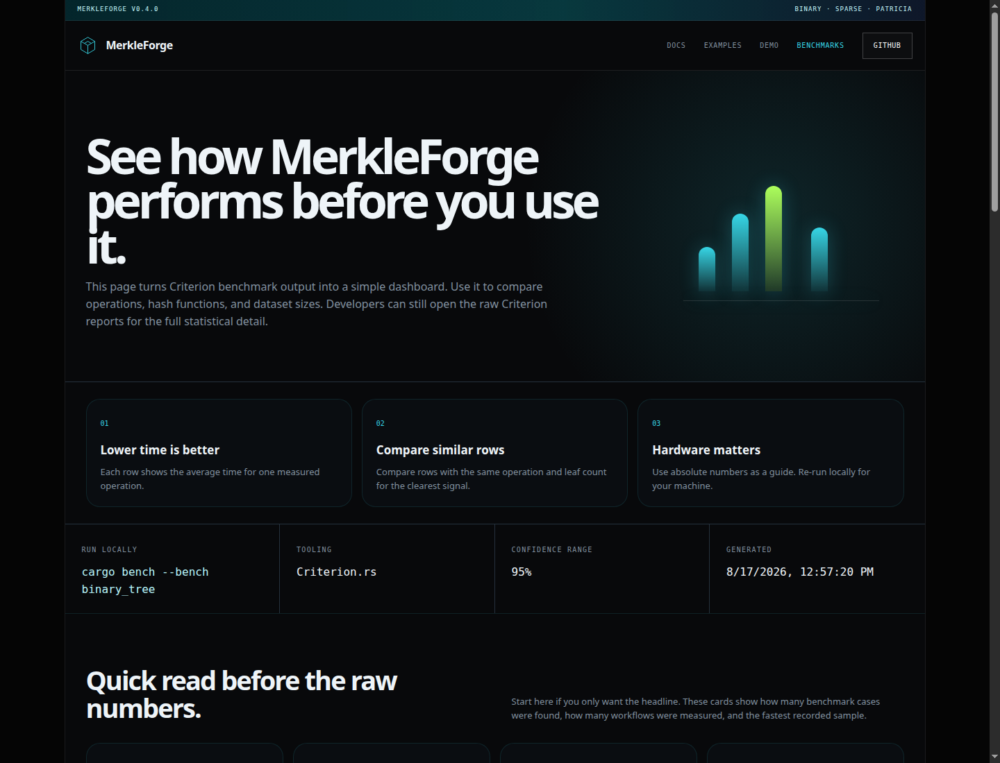

# Session Four: Implementation and Testing

## 4.1 System Development

### Overview Of The Overall System Development

MerkleForge was developed as a high-performance Rust toolkit for building and
testing Merkle-based verification systems. The system addresses the need for a
single, reusable library that supports multiple authenticated data structures
instead of forcing developers to combine separate libraries for binary Merkle
trees, sparse Merkle trees, and Ethereum-compatible Patricia tries.

The development process followed an incremental phase-based approach:

| Phase | Development Focus | Outcome |
| --- | --- | --- |
| Phase 1 | Core infrastructure | Shared traits, proof types, errors, serialization, hash adapters, CI setup |
| Phase 2 | Binary Merkle Tree | Flat-array binary tree, insertion/removal, proof generation, proof verification, property tests, benchmarks |
| Phase 3 | Sparse Merkle Tree | 256-bit sparse tree, empty-hash cache, key-addressed updates, membership/non-membership proofs, shortcut nodes, batching, batch updates |
| Phase 4 | Merkle Patricia Trie | Ethereum-compatible nibble paths, RLP/HP encoding, node hashing, insert/get/remove, proof generation, Ethereum test vectors |
| Phase 5 | Benchmarking and evaluation | Criterion benchmark suite, comparative benchmarks, energy-aware benchmark notes, public benchmark documentation |
| Phase 6 | Documentation and publication | Crate READMEs, website, live demo, release automation, user-facing documentation |

The system was designed around four main goals:

1. Provide a unified `MerkleTree<H>` interface for different tree variants.
2. Allow hash functions to be changed through Rust generics without rewriting
   tree logic.
3. Support stateless proof verification for light clients.
4. Provide measurable benchmark evidence for speed, proof size, and efficiency.

### System Development Architecture

The workspace is divided into focused crates so each part has a clear
responsibility:

```text
MerkleForge/
├── merkle-core/       # Shared traits, errors, proof types, metadata
├── merkle-hash/       # SHA-256, Keccak-256, and BLAKE3 hash adapters
├── merkle-variants/   # Binary, sparse, and Patricia tree implementations
├── merkle-bench/      # Criterion benchmark suite and comparison benchmarks
├── website/           # React + TypeScript documentation and demo website
├── benchmarks/        # Energy benchmark documentation
├── profiling/         # Flamegraph and profiling documentation
└── .github/workflows/ # CI, release, website, and benchmark publishing flows
```

The diagram below summarizes the logical flow of the system.



## 4.2 System Implementation

### How The System Was Built

The system was implemented in Rust using a workspace layout. Rust was selected
because it provides strong memory safety, deterministic performance, zero-cost
abstractions, and good support for cryptographic and systems-level code.

At the implementation level, MerkleForge is composed of the following modules.

### 1. `merkle-core`: Shared Foundation

The `merkle-core` crate contains the shared interfaces and types used across
the whole project. It does not implement any concrete tree. Instead, it defines
the contracts that all tree variants follow.

Main responsibilities:

- `HashFunction` trait for pluggable cryptographic algorithms.
- `MerkleTree` trait for shared tree operations.
- `ProofVerifier` trait for stateless proof verification.
- `Serializable` trait for proof and metadata encoding.
- `MerkleError` for consistent error reporting.
- `LeafIndex`, `NodeIndex`, `MerkleProof`, `ProofNode`, `ProofSide`, and
  `TreeMetadata` types.

Important codebase screenshots to include:

| Figure | Codebase Area | File |
| --- | --- | --- |
| Figure 4.1 | Shared Merkle tree trait | `merkle-core/src/traits/merkle_tree.rs` |
| Figure 4.2 | Hash function contract | `merkle-core/src/traits/hash_function.rs` |
| Figure 4.3 | Common proof types | `merkle-core/src/types/common.rs` |

### 2. `merkleforge-hash`: Hash Adapter Layer

The `merkleforge-hash` crate implements three hash adapters:

| Adapter | Algorithm | Main Use |
| --- | --- | --- |
| `Sha256` | SHA-256 | General-purpose binary and sparse trees |
| `Keccak256` | Keccak-256 | Ethereum-compatible Patricia trie roots |
| `Blake3` | BLAKE3 | High-throughput non-Ethereum workloads |

All adapters implement the same `HashFunction` trait. This means developers can
switch algorithms by changing only the tree type parameter:

```rust
use merkle_variants::BinaryMerkleTree;
use merkleforge_hash::{Blake3, Sha256};

let sha_tree = BinaryMerkleTree::<Sha256>::new();
let blake_tree = BinaryMerkleTree::<Blake3>::new();
```

The hash layer also applies domain separation. Leaf hashes and internal node
hashes are kept separate so an attacker cannot substitute an internal node as a
leaf value.

### 3. `merkle-variants`: Tree Implementations

The `merkle-variants` crate contains the concrete data structures.

#### Binary Merkle Tree

`BinaryMerkleTree<H>` is optimized for ordered datasets such as transaction
batches, logs, and file chunks. It uses flat array storage and computes parent
nodes bottom-up. It supports:

- Leaf insertion.
- Leaf removal.
- Root computation.
- Inclusion proof generation.
- Stateless proof verification.
- Generic `MerkleTree<H>` implementation.

#### Sparse Merkle Tree

`SparseMerkleTree<H>` is designed for very large key spaces where most entries
are empty. It supports a fixed 256-bit key space and avoids storing empty
branches.

Implemented sparse tree optimizations:

- Precomputed empty-hash cache with 257 entries.
- Key-addressed insert, remove, and get operations.
- Membership and non-membership proofs.
- Shortcut nodes for sparse subtrees containing only one leaf.
- Batched terminal subtrees for reduced storage overhead.
- Batch insert and batch remove APIs for rollup-style workloads.

#### Merkle Patricia Trie

`MerklePatriciaTrie<H>` implements an Ethereum-compatible trie. It uses
4-bit nibble paths and supports the four standard MPT node types:

- Empty node.
- Leaf node.
- Extension node.
- Branch node.

Implemented Patricia trie functionality:

- Nibble path extraction from byte keys.
- Hex-prefix path encoding.
- Recursive Length Prefix node encoding and decoding.
- Ethereum-style node references, where small nodes are inlined and large nodes
  are hashed.
- Insert, get, and remove operations.
- Canonical node collapsing after removal.
- EIP-1186-style proof generation.
- Verification against official Ethereum trie test vectors.

### 4. `merkle-bench`: Benchmarking Layer

The benchmark crate isolates performance testing from the runtime crates. It
contains Criterion benchmarks for:

- Hash throughput.
- Baseline leaf and node hashing.
- Binary tree construction and proof verification.
- Sparse tree inserts, proofs, non-membership proofs, and batch updates.
- Patricia trie inserts, gets, proofs, verification, and state roots.
- Comparative benchmarks against `rs-merkle` and `merkle_light`.
- Energy-aware construction timing.

The results are summarized in `BENCHMARKS.md` and published through the website
benchmark dashboard.

### 5. Website And Live Demo

The website was implemented with React, TypeScript, and Vite. It provides:

- A landing page explaining the project.
- A beginner-friendly documentation page.
- Examples with copyable code blocks.
- Benchmark results for developers and non-expert readers.
- A live light-client verification demo where users can edit transactions and
  verify proofs directly in the browser.

### Screenshots Of UI And System Workflows

The following screenshots were captured from the local website build.





Recommended codebase screenshots to include in the final report:

| Figure | Screenshot Content | Suggested File |
| --- | --- | --- |
| Figure 4.8 | Workspace manifest and shared dependency versions | `Cargo.toml` |
| Figure 4.9 | `MerkleTree` and `ProofVerifier` trait definitions | `merkle-core/src/traits/merkle_tree.rs` |
| Figure 4.10 | Binary tree proof generation implementation | `merkle-variants/src/binary.rs` |
| Figure 4.11 | Sparse tree membership/non-membership proof tests | `merkle-variants/tests/sparse_properties.rs` |
| Figure 4.12 | Patricia trie Ethereum vector test | `merkle-variants/tests/patricia_ethereum_vectors.rs` |
| Figure 4.13 | CI workflow for test, lint, docs, no_std, and benchmark checks | `.github/workflows/ci.yml` |

## 4.3 Testing Strategies

Testing was performed at several levels to ensure that the system works
correctly both as individual modules and as an integrated workspace.

### Unit Testing

Unit tests were used to test individual functions, data structures, and error
conditions. These tests are located mainly inside the Rust source files under
`merkle-core`, `merkle-hash`, and `merkle-variants`.

Examples of unit-tested behavior:

- Empty tree initialization.
- Empty leaf rejection.
- Root generation after insert.
- Proof verification success and failure.
- Hash determinism.
- Domain separation between leaf and internal node hashing.
- RLP encoding and decoding for Patricia trie nodes.
- Empty trie root matching the Ethereum known hash.

Local result:

```text
cargo test --workspace
merkle-core: 15 passed
merkleforge-hash: 21 passed
merkle-variants unit tests: 105 passed
```

### Integration Testing

Integration tests verify combined modules working together. These tests are
stored under `merkle-variants/tests/`.

Integration coverage includes:

- `binary_trait_contract.rs`: verifies that binary trees satisfy the shared
  `MerkleTree<H>` contract across SHA-256, Keccak-256, and BLAKE3.
- `binary_properties.rs`: verifies binary tree root sensitivity, proof
  correctness, tamper detection, and serialization.
- `sparse_properties.rs`: verifies sparse tree insert/remove behavior,
  membership proofs, non-membership proofs, batch-vs-sequential equivalence,
  and proof serialization.
- `patricia_properties.rs`: verifies Patricia trie insertion, removal,
  canonical root behavior, proof verification, and RLP round-trips.
- `patricia_ethereum_vectors.rs`: validates Patricia trie root output against
  official Ethereum trie test vectors.

Local integration result:

```text
binary_properties: 6 passed
binary_trait_contract: 3 passed
patricia_ethereum_vectors: 3 passed
patricia_properties: 9 passed
sparse_properties: 7 passed
doc tests: 2 passed, 5 ignored
```

### Property-Based Testing

Property-based tests were implemented with Proptest. Instead of testing only a
few fixed examples, Proptest generates many random inputs and checks that the
system invariants always hold.

Important properties tested:

- Any leaf mutation changes the binary tree root.
- Generated proofs verify immediately after insertion.
- Tampered proof siblings fail verification.
- Removing a leaf invalidates stale proofs.
- Sparse insert order is commutative for distinct keys.
- Sparse non-membership proofs verify for absent keys.
- Sparse batch insert equals sequential insert.
- Patricia insert followed by get returns the inserted value.
- Patricia insert order is canonical for the same key set.
- Patricia RLP encode/decode round-trips generated nodes.

### User Acceptance Testing

User Acceptance Testing focused on whether the project could be used by a
developer or evaluator without needing to understand the entire internal
codebase.

UAT activities:

| User Task | Acceptance Observation |
| --- | --- |
| Install the crates from the README | Dependency block is copyable and uses published `0.4` versions |
| Generate a binary tree proof | Quick-start example compiles and shows proof verification |
| View project documentation | Website documentation page explains installation, proofs, variants, recipes, and safety notes |
| Run a live proof demo | Website demo allows editing transactions and verifying a selected row in the browser |
| Inspect benchmark results | Benchmark page and `BENCHMARKS.md` explain latency, throughput, proof size, and comparison data |
| Verify CI quality | GitHub Actions runs test, lint, docs, no_std check, and benchmark compile checks |

## 4.4 Test Cases And Results

| Test Case ID | Test Case | Expected Result | Actual Result | Status |
| --- | --- | --- | --- | --- |
| TC-01 | Create a new `BinaryMerkleTree<Sha256>` | Tree is empty and root is `None` | New tree reports empty | Pass |
| TC-02 | Insert non-empty leaf into binary tree | Leaf count increases and root is created | Root generated successfully | Pass |
| TC-03 | Insert empty leaf data | Operation returns `MerkleError::EmptyLeafData` | Error returned without mutation | Pass |
| TC-04 | Generate proof for valid binary leaf | Proof verifies against root and leaf data | Proof verified successfully | Pass |
| TC-05 | Tamper proof sibling hash | Verification returns `false` | Tampered proof failed verification | Pass |
| TC-06 | Remove leaf from binary tree | Leaf is removed and root updates | Removal succeeded and stale proof failed | Pass |
| TC-07 | Create new sparse tree | Root equals precomputed empty sparse root | Empty root cache used | Pass |
| TC-08 | Sparse insert by 256-bit key | Root changes and leaf count increments | Root changed and leaf stored | Pass |
| TC-09 | Sparse non-membership proof for absent key | Proof verifies absence against root | Non-membership proof verified | Pass |
| TC-10 | Sparse batch insert vs sequential insert | Both methods produce same root | Roots matched | Pass |
| TC-11 | Sparse proof serialization round-trip | Serialized/deserialized proof verifies identically | Round-trip proof remained valid | Pass |
| TC-12 | Create new Patricia trie | Trie is empty and root is `None` | Empty trie initialized correctly | Pass |
| TC-13 | Patricia insert then get | Retrieved value equals inserted value | Value retrieved successfully | Pass |
| TC-14 | Patricia remove then get | Removed key returns `None` | Key removed successfully | Pass |
| TC-15 | Patricia RLP round-trip | `rlp_decode(rlp_encode(node)) == node` | Round-trip succeeded | Pass |
| TC-16 | Empty Patricia root | Root equals Ethereum empty trie hash | Matched known Ethereum root | Pass |
| TC-17 | Official Ethereum trie vectors | Computed roots match expected roots | All vector cases passed | Pass |
| TC-18 | Hash adapter determinism | Same input produces same digest | Deterministic output confirmed | Pass |
| TC-19 | Cross-hash trait contract | Tree works with SHA-256, Keccak-256, and BLAKE3 | Contract tests passed | Pass |
| TC-20 | Website build | React/TypeScript site builds successfully | `npm --prefix website run build` passed | Pass |
| TC-21 | Workspace test suite | All non-ignored tests pass | `cargo test --workspace` passed | Pass |

## 4.5 Performance Evaluation

Performance was evaluated using Criterion benchmarks. Criterion was selected
because it performs statistical measurement and reports confidence intervals,
which reduces noise compared to simple stopwatch timing.

### Benchmark Environment

| Item | Value |
| --- | --- |
| CPU | 11th Gen Intel(R) Core(TM) i7-1185G7 @ 3.00GHz |
| CPU layout | 4 cores / 8 threads, x86_64 |
| RAM | 15 GiB |
| OS | Linux 7.0.0-28-generic x86_64 GNU/Linux |
| Rust | rustc 1.97.1 |
| Date | 2026-08-17 |

### Hash Function Performance

| Algorithm | 32B latency | 64B latency | 1MB throughput |
| --- | --- | --- | --- |
| SHA-256 | 109.60 ns | 177.40 ns | 1.28 GiB/s |
| Keccak-256 | 1.23 us | 660.99 ns | 291.12 MiB/s |
| BLAKE3 | 230.70 ns | 247.83 ns | 5.99 GiB/s |

Interpretation:

- SHA-256 is strong for small inputs and is widely supported.
- Keccak-256 is required for Ethereum-compatible Patricia trie roots.
- BLAKE3 provides the highest throughput for large data and is useful for
  non-Ethereum workloads where maximum software speed is important.

### Binary Merkle Tree Performance

| Leaves | Construction (SHA-256) | Construction (BLAKE3) | Proof gen | Proof verify |
| --- | --- | --- | --- | --- |
| 100 | 147.19 us | 140.96 us | 45.22 ns | 1.09 us |
| 1,000 | 1.80 ms | 1.83 ms | 57.21 ns | 1.87 us |
| 10,000 | 30.53 ms | 39.07 ms | 74.18 ns | 2.06 us |
| 100,000 | 268.23 ms | 274.93 ms | 78.69 ns | 2.95 us |

Interpretation:

- Construction time grows as the number of leaves increases.
- Proof generation and verification remain very fast because proof paths grow
  logarithmically.
- This makes the binary tree suitable for transaction batches and file chunk
  verification.

### Sparse Merkle Tree Performance

| Existing keys | Insert (SHA-256) | Proof gen (SHA-256) | Proof verify (SHA-256) | Non-membership proof |
| --- | --- | --- | --- | --- |
| 10 | 189.85 us | 244.18 us | 91.43 us | 268.20 us |
| 100 | 2.11 ms | 2.25 ms | 75.74 us | 2.32 ms |
| 1,000 | 20.24 ms | 20.32 ms | 81.58 us | 20.12 ms |
| 10,000 | 181.05 ms | 198.84 ms | 63.00 us | 203.49 ms |

Sparse batch updates showed significant improvement compared with repeated
sequential insertion:

| Batch size | Batch insert | Sequential insert | Speedup |
| --- | --- | --- | --- |
| 10 | 288.97 us | 1.53 ms | 5.30x |
| 100 | 2.08 ms | 88.12 ms | 42.46x |
| 1,000 | 20.33 ms | 8.69 s | 427.72x |

Interpretation:

- Sparse trees are useful for huge state maps where most slots are empty.
- Non-membership proofs are important because they prove that a key does not
  exist.
- Batch updates are especially useful for rollup workloads because shared path
  segments are recomputed once instead of repeatedly.

### Comparative Benchmark Results

| Metric | MerkleForge | `rs-merkle` | `merkle_light` |
| --- | --- | --- | --- |
| 10K leaf construction | 22.77 ms | 3.69 ms | 2.29 ms |
| Proof size, 10K tree | 469 bytes | 448 bytes | 512 bytes |
| Proof verification | 1.84 us | 6.39 us | 1.78 us |

Interpretation:

- MerkleForge is competitive in proof size and proof verification.
- `rs-merkle` and `merkle_light` are faster in the current 10K construction
  baseline.
- MerkleForge provides broader functionality because it includes binary, sparse,
  and Patricia variants under one API.

### Energy-Aware Benchmark

| Algorithm | 100K construction time | CPU cycles | Energy package joules |
| --- | --- | --- | --- |
| SHA-256 | 463.52 ms | not captured | not captured |
| Keccak-256 | 1.49 s | not captured | not captured |
| BLAKE3 | 261.02 ms | not captured | not captured |

The current energy-aware benchmark records wall-clock construction time. CPU
cycles and package joules require Linux `perf` or another power measurement
tool on supported hardware. These fields should be regenerated on the final
benchmark machine before the final paper submission.

## 4.6 Application Manual

### Steps For User Operations

#### A. Install MerkleForge Crates

Add the crates to a Rust project's `Cargo.toml`:

```toml
[dependencies]
merkle-core = "0.4"
merkleforge-hash = "0.4"
merkle-variants = "0.4"
```

#### B. Create A Binary Merkle Tree

```rust
use merkle_core::prelude::*;
use merkle_variants::BinaryMerkleTree;
use merkleforge_hash::Sha256;

fn main() -> Result<(), MerkleError> {
    let mut tree = BinaryMerkleTree::<Sha256>::new();
    tree.insert(b"alice:100")?;
    tree.insert(b"bob:250")?;

    let root = tree.root().expect("tree is not empty");
    println!("root: {:?}", root);

    Ok(())
}
```

#### C. Generate And Verify A Proof

```rust
let proof = tree.generate_proof(LeafIndex(0))?;
let valid = BinaryMerkleTree::<Sha256>::verify(root, b"alice:100", &proof);
assert!(valid);
```

#### D. Run The Stateless Light-Client Demo

```bash
cargo run -p merkle-variants --example light_client
```

Expected output:

```text
server: built tree and exported root + proof
client: tree dropped before verification
Stateless verification: true
```

#### E. Run Tests

```bash
cargo test --workspace
```

For the release-style test command:

```bash
make test
```

#### F. Run Linting And Formatting

```bash
make fmt
make lint
```

#### G. Run Benchmarks

```bash
cargo bench --bench hash_throughput
cargo bench --bench binary_tree
cargo bench --bench sparse_tree
cargo bench --bench patricia_trie
cargo bench --bench comparison
cargo bench --bench bench_energy
```

Criterion reports are generated under:

```text
target/criterion/
```

#### H. Run The Website Locally

```bash
npm --prefix website ci
VITE_BASE_PATH=/ npm --prefix website run build
VITE_BASE_PATH=/ npm --prefix website run preview
```

Then open:

```text
http://127.0.0.1:4173/
```

### Changeover Procedures

The changeover procedure explains how to move from manual local development to
the deployed project state.

#### 1. Development Changeover

1. Create or update a feature branch from `develop`.
2. Implement the change in the correct crate or website module.
3. Run formatting, linting, tests, and any relevant benchmark compile checks.
4. Commit the change with a clear conventional commit message.
5. Push the branch and open a pull request into `develop`.
6. Review CI results and resolve all failures.
7. Merge into `develop` after review.

#### 2. Release Changeover

1. Merge `develop` into `main` through a pull request.
2. Ensure CI passes on `main`.
3. Run the manual release workflow with the target version.
4. Confirm that crates are published to crates.io.
5. Confirm that the GitHub release tag exists.
6. Confirm that documentation and website pages point to the correct version.

#### 3. Benchmark Publishing Changeover

1. Push benchmark-ready code to `main`.
2. The benchmark publishing workflow runs Criterion benchmarks.
3. Generated reports are copied into the GitHub Pages artifact.
4. The website dashboard links users to the latest benchmark reports.
5. `BENCHMARKS.md` should be updated when new final benchmark numbers are
   collected.

#### 4. User Changeover

For users moving from another Merkle library:

1. Install `merkle-core`, `merkleforge-hash`, and `merkle-variants`.
2. Replace library-specific tree construction with a MerkleForge tree variant.
3. Choose the hash adapter required by the application.
4. Generate a root and proof using the MerkleForge API.
5. Verify proofs statelessly using only the root, proof, and target data.
6. Use benchmarks to decide whether binary, sparse, or Patricia storage best
   fits the workload.

## Summary

Session Four produced a complete implementation and testing record for
MerkleForge. The system now includes reusable Rust crates, multiple Merkle tree
variants, stateless proof verification, Ethereum-compatible Patricia trie
support, property-based tests, official Ethereum vector validation, benchmark
evidence, and a React documentation website with a live proof demo.

The local verification run confirmed that the workspace test suite passed:

```text
cargo test --workspace
Result: passed
```

The remaining performance documentation work is to capture final RSS memory
usage and complete any benchmark rows currently marked `not captured` in
`BENCHMARKS.md` on the final evaluation machine.
